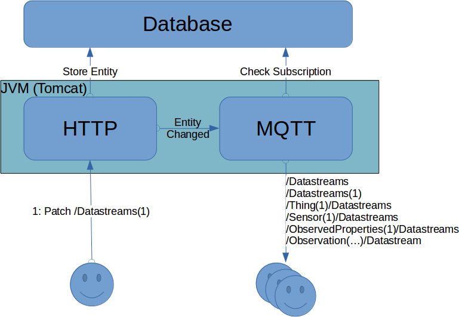
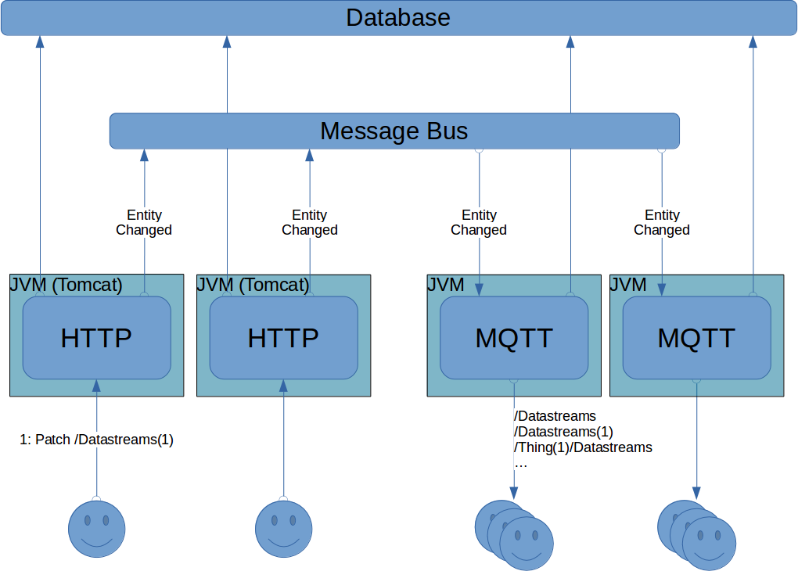

# Package Architecture

The FROST-Server comes in three packages, and thus also in three docker images:

* [fraunhoferiosb/frost-server](https://hub.docker.com/r/fraunhoferiosb/frost-server/) The all-in-one package
* [fraunhoferiosb/frost-server-http](https://hub.docker.com/r/fraunhoferiosb/frost-server-http/) The HTTP-only package
* [fraunhoferiosb/frost-server-mqtt](https://hub.docker.com/r/fraunhoferiosb/frost-server-mqtt/) The MQTT-only package

## All In One

The all-in-one package contains both the HTTP and the MQTT parts of the FROST-Server. As such, it is the easiest way to get a server up and running.
Because everything runs in the same JVM, the HTTP and MQTT parts can directly communicate, and there is only minimal delay between entities being updated,
and MQTT messages being sent out.

The disadvantage is that everything runs in the same JVM. If the number of connections and requests increases, there is no way to scale this architecture
up by adding more servers. You can add a second server next to the first one, and connect it to the same (replicated) database, but if an entity is added
or updated through server one, the clients connected to the MQTT interface on server two never get notified.

## Separated HTTP & MQTT packages

To make it possible to have multiple HTTP and MQTT instances, a message bus was introduced in the architecture and the http and mqtt parts of the server
were moved to separate packages.

This way, there can be an arbitrary number of HTTP and MQTT components, connecting to the same (replicated) database, and communicating among each
other through the message bus. Currently there is only one implementation of the message bus connector, that uses an external MQTT server.

